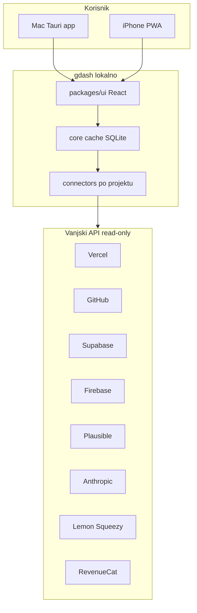

# gdash — master plan (iz razgovora)

## Vizija

**gdash** je lokalna aplikacija (ne deploy na internet) koja na jednom mjestu prikazuje zdravlje i troškove više produkata. Za svaki projekt (npr. `ai-rules.dev`) wizard pri setupu pita samo što taj stack treba; nakon kreiranja otvara se **projektni dashboard**. Vanjske servise ne pregledavaš ručno u browseru — gdash zove **read-only API-je** s Maca ili iPhonea.

Postojeća evidencija servisa u repou: [services-docs/](services-docs/) ([SERVICES.md](services-docs/SERVICES.md) = FlowKeep, [SERVICES 2.md](services-docs/SERVICES%202.md) = AI Rules, [SERVICES 3.md](services-docs/SERVICES%203.md) = CAPTIVE). UI spec: [DESIGN.md](DESIGN.md).



---

## Produkti i connectori (iz SERVICES dokumenata)

| Projekt | Slug (predložak) | Stack tip | Ključni connectori za monitoring |
|---------|------------------|-----------|----------------------------------|
| **FlowKeep** | `flowkeep` | `macos-landing` | HTTP `flowkeep.dev`, Vercel, GitHub Actions, Plausible, Lemon Squeezy, Resend; lokalno `crash.log` (Mac only) |
| **AI Rules Generator** | `ai-rules` | `next-vercel-supabase` | HTTP `ai-rules.dev`, Vercel, GitHub, Supabase, Anthropic/OpenAI, Lemon Squeezy |
| **CAPTIVE** | `captive` | `expo-firebase` | Firebase/CF, Anthropic, RevenueCat, Expo/EAS, GitHub, Cloudflare Pages |

**Namjerno izvan MVP connectora:** Sentry, PostHog, Stripe direktno (nema u projektima). Crash na FlowKeepu = lokalni log; CAPTIVE Crashlytics = post-MVP.

---

## Arhitektura repozitorija (monorepo)

```
gdash/
├── PLAN.md
├── DESIGN.md
├── services-docs/
├── packages/
│   ├── ui/
│   ├── core/
│   └── connectors/
├── apps/
│   ├── desktop/
│   └── web-pwa/
└── templates/
    └── project-types/
```

**Lokalni podaci (gitignored):** `~/.config/gdash/` — projects, cache, settings.

---

## Korisnički flowovi

Vidi sekcije u planu: wizard, hibrid refresh, rute (`/`, `/projects/:slug`, `/costs`, …).

---

## Sekcija Troškovi (obavezno)

Parsiranje `SERVICES.md`, opcionalno `SERVICES.private.md`, lokalni `costs.json`. UI: CostSummaryRow, CostServiceTable, CostMonthlyLedger.

---

## UI i dizajn

Katteb stil, **lucide-react** only, **bez emojija**. Vidi [DESIGN.md](DESIGN.md).

---

## Platforme i besplatni model

- macOS: Tauri (0 €)
- iPhone: PWA Add to Home Screen (0 €)
- Nema gdash SaaS hosta

---

## Faze implementacije

1. Foundation (Mac + UI shell)
2. Monitoring (http, github, checklist)
3. Costs + extended connectors
4. iPhone PWA
5. Polish (opcionalno)

---

## Verifikacija

- **F1:** Tauri/web app, wizard, navigacija
- **F2:** Cache + live refresh
- **F3:** Costs ekrani
- **F4:** PWA responsive
